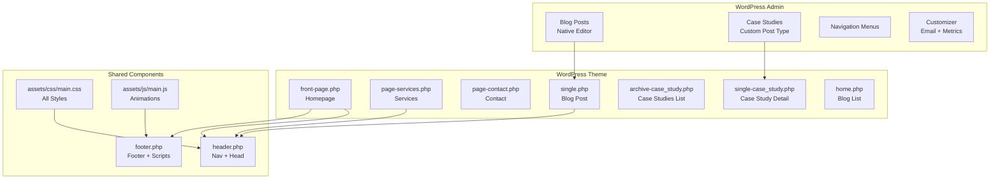
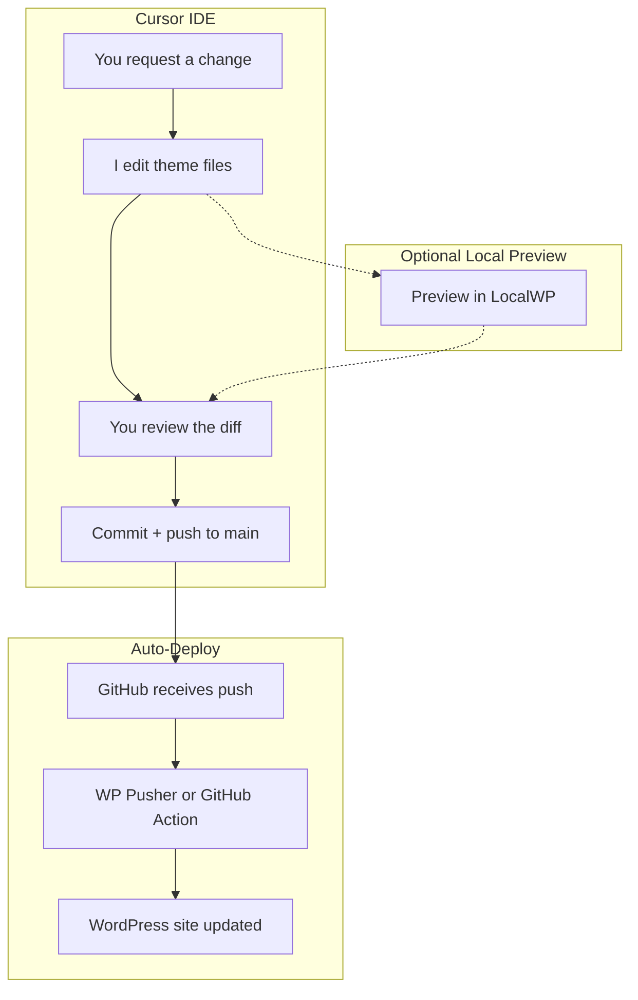

# AMP Custom WordPress Theme

## Architecture

Build a classic WordPress theme in `/amp-theme/` that ports the branded prototype design into a fully functional WordPress site. The user can later move this folder into its own repo and install it on any WordPress host.




## Repo Setup

### Option A: Build in This Workspace, Move Later (Recommended for Now)

Since we're using Cursor for development, the simplest approach is to build the theme as a folder inside the current `affiliate-backend` repo, then move it to its own repo when it's ready. This keeps everything in one Cursor workspace during development.

1. Create `amp-theme/` folder inside the current workspace root (`/Users/alexander.robinson/Documents/GitHub/affiliate-backend/amp-theme/`)
2. Build the entire theme there
3. When the theme is complete and tested, create a dedicated repo and move the files

### Option B: New Repo from the Start

If you'd rather keep it separate from day one:

1. Create a new GitHub repo:

```bash
cd ~/Documents/GitHub
mkdir amp-wordpress-theme
cd amp-wordpress-theme
git init
```

1. Or create it on GitHub first and clone:

```bash
cd ~/Documents/GitHub
gh repo create amp-wordpress-theme --private --clone
cd amp-wordpress-theme
```

1. Open the new repo in Cursor as a separate workspace

### Repo Structure (Either Option)

```
amp-wordpress-theme/              # repo root
├── .gitignore
├── README.md
├── .github/
│   └── workflows/
│       └── deploy.yml            # (optional) GitHub Actions auto-deploy
├── amp-theme/                    # the actual WP theme folder
│   ├── style.css
│   ├── functions.php
│   ├── header.php
│   ├── footer.php
│   ├── front-page.php
│   ├── ... (all theme files)
│   └── assets/
└── docs/
    └── cutover-checklist.md      # migration checklist for go-live day
```

The theme lives inside `amp-theme/` rather than at repo root so that:

- You can zip just the `amp-theme/` folder and upload it directly to WordPress (Appearance > Themes > Upload)
- The repo root stays clean for docs, CI config, or a future deploy script

### .gitignore

```
# WordPress
*.log
wp-config.php
wp-content/uploads/
node_modules/

# OS
.DS_Store
Thumbs.db

# IDE
.vscode/
.idea/
```

### README.md (Auto-Generated During Phase 1)

Will include:

- Theme name and description
- Local development instructions (how to set up a local WordPress install with this theme)
- Deployment instructions (how to upload to a WordPress host)
- File structure overview
- Plugin requirements

### Local Development Options

To preview the theme while building, you have a few options:

- **LocalWP** (recommended, free) -- One-click local WordPress environment. Download from localwp.com, create a site, symlink or copy `amp-theme/` into `wp-content/themes/`, activate it, and see changes in real time.
- **MAMP/XAMPP** -- Traditional local server stack. More setup but equally capable.
- **Docker** -- `docker-compose.yml` with WordPress + MySQL. Good if you're comfortable with Docker.
- **Build blind** -- Since the theme's CSS/JS is ported directly from the HTML prototype you already approved, the visual output will match. You can build the PHP templates and test at the staging step. This is faster but riskier if structural changes are needed.

### Git-to-WordPress Deployment (How Cursor Changes Go Live)

This is the key workflow: you ask me to make changes in Cursor, we commit them to GitHub, and those changes automatically deploy to your live WordPress site. There are three approaches, ranked by recommendation:

**Option 1: WP Pusher Plugin (Recommended -- Simplest)**

WP Pusher is a WordPress plugin that connects your site directly to your GitHub repo. When you push to `main`, it automatically pulls the updated theme files.

Setup:

1. Install WP Pusher plugin on your WordPress site (free for public repos, $99 one-time for private repos)
2. In WP Pusher settings, connect your GitHub account via access token
3. Go to WP Pusher > Install Theme, enter your repo (e.g., `yourusername/amp-wordpress-theme`)
4. Set the subdirectory to `amp-theme/` and the branch to `main`
5. Enable "Push-to-Deploy" -- WP Pusher automatically registers a GitHub webhook
6. Done. Every `git push` to `main` triggers an automatic theme update on the live site.

The workflow becomes:


**Option 2: GitHub Actions + SFTP (More Control)**

If your host doesn't support WP Pusher well, or you want a build step (e.g., minifying CSS/JS), use a GitHub Action that deploys via SFTP on every push.

Setup:

1. Add your host's SFTP credentials as GitHub Secrets (`FTP_SERVER`, `FTP_USERNAME`, `FTP_PASSWORD`)
2. Create `.github/workflows/deploy.yml` in the repo:

```yaml
name: Deploy Theme
on:
  push:
    branches: [main]
jobs:
  deploy:
    runs-on: ubuntu-latest
    steps:
      - uses: actions/checkout@v4
      - name: Deploy via SFTP
        uses: SamKirkland/FTP-Deploy-Action@v4
        with:
          server: ${{ secrets.FTP_SERVER }}
          username: ${{ secrets.FTP_USERNAME }}
          password: ${{ secrets.FTP_PASSWORD }}
          local-dir: ./amp-theme/
          server-dir: /wp-content/themes/amp-theme/
```

1. Every push to `main` auto-deploys the theme to your host.

**Option 3: WP Engine GitPush (If Using WP Engine Hosting)**

WP Engine has native Git deployment built into their hosting. You add a WP Engine remote to your repo and push directly.

Setup:

1. Generate an ED25519 SSH key pair
2. Add the public key to your WP Engine User Portal
3. Add the WP Engine remote: `git remote add production git@git.wpengine.com:production/yourinstall.git`
4. Deploy with: `git push production main`

This can also be automated via WP Engine's official GitHub Action.

**Recommendation**: Go with **Option 1 (WP Pusher)** unless you choose WP Engine as your host (then use Option 3). Both give you the same end result: you ask me to make a change, I edit the code, we push to GitHub, and the live site updates automatically within seconds.

### Full Development Workflow




The "Optional Local Preview" path is there if you ever want to see changes before they go live. For most edits (copy changes, styling tweaks, new blog post templates), pushing directly is fine since you can always revert with `git revert`.

---

## Theme File Structure

```
amp-theme/
├── style.css                     # Theme metadata (required by WP)
├── functions.php                 # Theme setup, enqueues, menus, CPT
├── header.php                    # doctype, head, nav, mobile menu
├── footer.php                    # CTA section, footer, scripts
├── front-page.php                # Homepage (all 9 sections)
├── page-services.php             # Services page (expanded detail)
├── page-contact.php              # Contact form page
├── single-case_study.php         # Individual case study layout
├── archive-case_study.php        # Case studies grid listing
├── single.php                    # Blog post layout
├── home.php                      # Blog listing page
├── 404.php                       # 404 page
├── assets/
│   ├── css/
│   │   └── main.css              # Full CSS from branded prototype
│   ├── js/
│   │   └── main.js               # Scroll animations, counters, nav
│   └── images/
│       └── .gitkeep
├── inc/
│   ├── post-types.php            # Case Study CPT + meta boxes
│   └── customizer.php            # Theme Customizer settings
├── template-parts/
│   ├── home-hero.php             # Hero section
│   ├── home-trust-bar.php        # Client trust bar
│   ├── home-services.php         # Services bento grid
│   ├── home-case-studies.php     # Case study proof section
│   ├── home-why-amp.php          # Why AMP / about section
│   ├── home-testimonials.php     # Testimonials
│   ├── content-case-study.php    # Case study card (reusable)
│   └── content-blog-card.php     # Blog post card (reusable)
└── screenshot.png                # Theme preview (generated)
```

## Design System

All styles ported directly from `amp-homepage-branded.html` (the version you approved):

- **Dark navy:** #0D1219 -- **Navy:** #192333 -- **Blue:** #1A24E2 -- **Marigold:** #FFB000 -- **Light navy mist:** #F0F2F5
- **Fonts:** Plus Jakarta Sans (headings) + Inter (body) via Google Fonts
- **Glass cards:** `rgba(255,255,255,0.04)` bg + `rgba(255,255,255,0.08)` border preserved
- **Gradient meshes:** Hero + Why AMP + CTA radial gradients preserved
- **Animations:** IntersectionObserver fade-ins, number counters, hover lifts preserved

## Build Phases

### Phase 1: Theme Foundation

- `style.css` -- Theme metadata header (name, version, description)
- `functions.php` -- Theme setup: register nav menus, enqueue `main.css` + `main.js` + Google Fonts, add theme supports (title-tag, post-thumbnails, custom-logo, html5)
- `header.php` -- `<!DOCTYPE html>` through closing `</nav>`, including mobile menu overlay. Uses `wp_nav_menu()` for nav links. Sticky nav with scroll behavior.
- `footer.php` -- CTA section + footer HTML + `wp_footer()` hook. Contact email pulled from Customizer setting.
- `assets/css/main.css` -- Complete CSS extracted from branded prototype (all 1100+ lines of styles, responsive breakpoints, animations)
- `assets/js/main.js` -- Scroll progress, sticky nav, mobile menu toggle, IntersectionObserver fade-ins, animated number counters

### Phase 2: Homepage

- `front-page.php` -- Assembles homepage from template parts using `get_template_part()`
- 7 template parts in `template-parts/` -- Each homepage section as its own file for maintainability
- Hero metrics pulled from Customizer settings (so you can update numbers without editing code)
- Case study section queries the 2 most recent case_study posts
- Testimonials hardcoded (you have 2 and they rarely change)

### Phase 3: Case Studies

- `inc/post-types.php` -- Registers `case_study` CPT with custom meta box containing fields:
  - Client Name (text)
  - 3x Metric Value + Metric Label pairs
  - Testimonial Quote (textarea)
  - Quote Author + Title (text)
- `single-case_study.php` -- Full case study page: accent bar, metrics row, content (from WP editor), testimonial pull-quote, CTA
- `archive-case_study.php` -- Grid listing of all case studies using the card design from the homepage
- `template-parts/content-case-study.php` -- Reusable case study card component

### Phase 4: Blog

- `home.php` -- Blog listing with card grid, pagination. Uses the same card design language.
- `single.php` -- Blog post with clean reading layout, author byline, date, tags, related posts section
- `template-parts/content-blog-card.php` -- Reusable blog card (title, date, excerpt, read more link)

### Phase 5: Services + Contact

- `page-services.php` -- Expanded services page with full descriptions, process section. Uses a custom page template.
- `page-contact.php` -- Contact form (designed for WPForms Lite or Contact Form 7 shortcode) + contact info + "what to expect" blurb

### Phase 6: Polish

- `404.php` -- Styled 404 page with search + nav back to homepage
- `inc/customizer.php` -- Customizer panel for: contact email, hero metric values (4 numbers), CTA button text
- Responsive testing pass on all templates
- `screenshot.png` -- 1200x900 theme preview image

## Case Study Workflow (What You Do in WP Admin)

1. Go to Case Studies > Add New
2. Enter the client name, 3 metrics (value + label), and an optional testimonial
3. Write the full case study narrative (Objective, Solution, Results) in the standard WordPress editor
4. Publish -- it automatically appears on the Case Studies archive page and the homepage "Proof" section pulls the latest 2

## Blog Workflow

1. Go to Posts > Add New
2. Write your post using the WordPress block editor
3. Publish -- it appears on the Blog page with the branded card layout

## Recommended Plugins (Install After Theme)

- **Yoast SEO** (free) -- Meta titles, descriptions, sitemaps, Open Graph
- **Google Site Kit** (free) -- Google Analytics + Search Console integration
- **WPForms Lite** (free) -- Contact form on the Contact page
- **WP Super Cache** or **LiteSpeed Cache** (free) -- Page caching for speed
- **UpdraftPlus** (free) -- Automated backups
- **Redirection** (free) -- Set up 301 redirects from old Squarespace URLs

## Squarespace-to-WordPress Cutover Plan

### Pre-Migration (Before Building)

- **Content inventory** -- Document every page, URL, and asset on the current Squarespace site:


| Squarespace URL                                            | WordPress URL                                               | Type                 |
| ---------------------------------------------------------- | ----------------------------------------------------------- | -------------------- |
| `/`                                                        | `/`                                                         | Homepage             |
| `/ourprocess`                                              | `/services/`                                                | Services page        |
| `/contact-us`                                              | `/contact/`                                                 | Contact page         |
| `/ampcasestudies`                                          | `/case-studies/`                                            | Case studies archive |
| `/ampcasestudies/floatmecasestudy`                         | `/case-studies/floatme/`                                    | Case study           |
| `/ampcasestudies/rydercasestudy`                           | `/case-studies/ryder-toys/`                                 | Case study           |
| `/blog`                                                    | `/blog/`                                                    | Blog listing         |
| `/blog/secret-to-affiliate-success-is-ai`                  | `/blog/secret-to-affiliate-success-is-ai/`                  | Blog post            |
| `/blog/advancedfundsnetwork-and-amp`                       | `/blog/advancedfundsnetwork-and-amp/`                       | Blog post            |
| `/blog/floatme-and-amp`                                    | `/blog/floatme-and-amp/`                                    | Blog post            |
| `/blog/arro-finance-and-amp`                               | `/blog/arro-finance-and-amp/`                               | Blog post            |
| `/blog/piere-and-amp`                                      | `/blog/piere-and-amp/`                                      | Blog post            |
| `/blog/why-fintech-needs-a-specialized-affiliate-strategy` | `/blog/why-fintech-needs-a-specialized-affiliate-strategy/` | Blog post            |
| `/floatme-amp`                                             | Redirect to `/case-studies/floatme/`                        | Redirect             |


- **Download all images** from Squarespace CDN (logo, any blog images, client assets)
- **Export blog content** -- Squarespace allows XML export (Settings > Advanced > Import/Export). This can be imported directly into WordPress via Tools > Import.

### Staging Build (Parallel to Development)

1. **Set up WordPress on a staging URL** (e.g., `staging.affiliatemarketingpartners.co` or a temporary host subdomain)
2. Install and activate the custom theme
3. Install all recommended plugins
4. **Import blog posts** using the Squarespace XML export
5. **Manually create case studies** as case_study posts (only 2, takes 15 minutes)
6. **Create static pages** -- Services, Contact (assign page templates)
7. **Set up navigation menu** in Appearance > Menus
8. **Configure Yoast SEO** -- Set homepage meta title/description, configure XML sitemap
9. **Configure 301 redirects** using the Redirection plugin (see URL table above)
10. **Test every page** on staging -- Check all links, forms, mobile responsiveness

### DNS Cutover (Go-Live Day)

1. **Final content check** on staging -- Make sure everything matches or exceeds the Squarespace site
2. **Disable Squarespace site** -- Put in maintenance mode (do NOT delete yet)
3. **Update DNS records** -- Point `affiliatemarketingpartners.co` A record to your WordPress host IP. If using `ampconsulting.co` as well, point that too.
4. **Install SSL certificate** -- Most hosts (WP Engine, SiteGround) do this automatically with Let's Encrypt
5. **Verify 301 redirects are working** -- Test every old Squarespace URL and confirm it redirects to the correct WordPress URL
6. **Submit updated sitemap** to Google Search Console (`yourdomain.co/sitemap_index.xml`)
7. **Monitor for 48 hours** -- Watch for 404 errors in Google Search Console and fix any missed redirects

### Post-Migration (First 2 Weeks)

- Monitor Google Search Console for crawl errors daily
- Check Google Analytics for traffic drop-offs (some is normal during DNS propagation)
- Verify all old Squarespace backlinks still resolve (use Ahrefs or Ubersuggest free tier)
- Keep Squarespace account active for 30 days as a safety net, then cancel
- Update any external profiles that link to old URLs (LinkedIn, Everflow partner page, etc.)

---

## SEO, GEO, and AIO Audit Checklist

### Traditional SEO Audit (Do at Launch)

**Technical SEO:**

- XML sitemap generated and submitted to Google Search Console (Yoast handles this)
- `robots.txt` allows crawling of all public pages
- SSL certificate active (HTTPS everywhere, no mixed content)
- Page load speed under 3 seconds (test with Google PageSpeed Insights)
- Core Web Vitals passing (LCP < 2.5s, FID < 100ms, CLS < 0.1)
- Mobile-friendly test passing (Google Mobile-Friendly Test)
- No broken links (run Broken Link Checker plugin after migration)
- Canonical URLs set correctly on all pages
- 301 redirects working for all old Squarespace URLs

**On-Page SEO (per page):**

- Unique meta title (under 60 chars) with primary keyword
- Unique meta description (under 160 chars) with CTA language
- Single H1 per page, descriptive and keyword-rich
- Proper heading hierarchy (H1 > H2 > H3, no skipping levels)
- Image alt text on all images (descriptive, not keyword-stuffed)
- Internal linking between related pages (case studies link to services, blog posts link to case studies)
- External links to credible sources where relevant (blog posts)
- Open Graph tags for social sharing (Yoast handles this)

**Content SEO:**

- Each blog post targets a specific long-tail keyword
- Service pages target "fintech affiliate marketing" + variations
- Case studies target "[client name] + affiliate marketing case study"
- Homepage targets "fintech affiliate marketing agency"

**Structured Data (Schema Markup -- built into theme):**

- `Organization` schema on homepage (company name, logo, contact, social links)
- `Person` schema for Jessica Robinson (founder, credentials, ex-PayPal)
- `Article` schema on all blog posts (author, date, headline)
- `FAQPage` schema on services page (if FAQ section is added)
- `BreadcrumbList` schema on all interior pages

### GEO Audit (Generative Engine Optimization)

GEO is about getting your content cited by AI search engines (Google AI Overviews, ChatGPT, Perplexity, Claude). This is critical for fintech brands in 2026.

**Content Structure for AI Parsing:**

- Every page begins with a direct, factual answer to the question it addresses (AI models pull from the first substantive paragraph)
- Use semantic HTML headings (H2, H3) that mirror natural language questions: "What does a fintech affiliate agency do?" rather than clever/branded headers
- Add FAQ blocks to key pages (Services, homepage) with `FAQPage` schema markup
- Blog posts should open with a TL;DR summary paragraph that AI can quote directly

**Entity and Authority Signals:**

- Jessica Robinson's credentials prominently displayed (ex-PayPal, 14+ years) -- this establishes E-E-A-T (Experience, Expertise, Authority, Trust)
- Author bylines on all blog posts with structured `Person` schema
- Company "About" content that clearly states what AMP does, for whom, and where (AI models use this for entity recognition)
- Consistent NAP (Name, Address, Phone) across the site and external directories

**Topical Authority Clusters:**

- Build content clusters around core topics: "fintech affiliate marketing," "app monetization," "affiliate program management," "financial compliance in affiliate marketing"
- Each cluster has a pillar page (e.g., the Services page) and supporting blog posts that interlink
- This signals to AI models that AMP is an authority on these topics

**Citability:**

- Include original data, statistics, and specific results (your case study metrics are gold -- "+241% YoY revenue" is the kind of specific claim AI models cite)
- Publish original thought leadership (the "AI (Agency Insights)" blog post is a great example)
- Get mentioned on high-authority sites that AI models trust (industry publications, partner sites like Everflow, conference speaker pages)

**WordPress Plugin for GEO:**

- Install **LovedByAI** or similar GEO-specific plugin to monitor AI visibility and get recommendations
- Use **Rank Math** (alternative to Yoast) if you want built-in schema markup controls with less manual configuration

### AIO Audit (AI Optimization)

AIO extends GEO to cover how your brand appears across all AI assistants (not just search). The goal: when a fintech CEO asks ChatGPT "what's a good affiliate marketing agency for fintech?", AMP shows up in the answer.

**Brand Presence Optimization:**

- Ensure AMP is listed on affiliate industry directories and platforms (Impact partner directory, Everflow partner page, Affiliate Summit speaker lists)
- Maintain updated profiles on LinkedIn (company page + Jessica Robinson's personal profile)
- Get client reviews on G2, Clutch, or similar B2B review platforms -- AI models heavily weight these
- Ensure Wikipedia-style factual accuracy on all external mentions (consistent company name, founding year, services)

**Content That AI Assistants Surface:**

- Write content that answers the exact prompts people type into AI: "best affiliate marketing agency for fintech," "how to launch a fintech affiliate program," "fintech affiliate compliance best practices"
- Include comparison content: "Why fintech needs a specialized affiliate agency vs. a generalist" (AI loves comparison frameworks)
- Create definitive, long-form guides that become reference material (your "Why Fintech Needs a Specialized Affiliate Strategy" post is a strong start -- expand it)

**Technical AIO:**

- Ensure clean, server-rendered HTML (WordPress does this natively, unlike JS-heavy frameworks)
- Implement `llms.txt` file at site root (emerging standard for communicating site structure to AI crawlers)
- Do not block AI crawlers in `robots.txt` (some sites block GPTBot -- you want the opposite)
- Keep content publicly accessible (no paywalls, no login walls)

### Ongoing SEO/GEO/AIO Calendar


| Frequency | Task                                                                                     |
| --------- | ---------------------------------------------------------------------------------------- |
| Weekly    | Publish 1 blog post targeting a fintech affiliate keyword                                |
| Monthly   | Check Google Search Console for new queries driving impressions, optimize existing pages |
| Monthly   | Monitor AI visibility (ask ChatGPT/Perplexity about your category, see if AMP appears)   |
| Quarterly | Update case study metrics with latest data                                               |
| Quarterly | Audit and update schema markup                                                           |
| Quarterly | Review and refresh top-performing blog posts                                             |
| Annually  | Full technical SEO audit (speed, Core Web Vitals, broken links)                          |


---

## Deployment

Once the theme is built:

1. Create a new GitHub repo (e.g., `amp-wordpress-theme`)
2. Push the `amp-theme/` folder contents
3. Install WordPress on your host (WP Engine, SiteGround, Bluehost, etc.)
4. Upload the theme via Appearance > Themes > Add New > Upload
5. Activate, set up menus, install recommended plugins
6. Create the static pages (Services, Contact) and start adding case studies + blog posts
7. Run through the SEO/GEO/AIO audit checklist above
8. Execute the cutover plan (staging > DNS switch > redirect verification)
9. Monitor for 2 weeks post-launch
